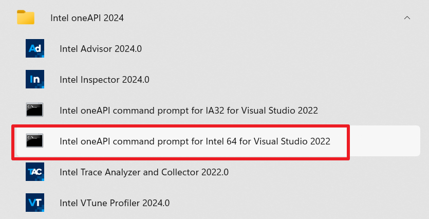

.. _building-windows-wheels:

Building on Windows
===================

Dependencies
------------

- **Python** >= 3.10  
- **NumPy** == 2.1.0 (Required only for building the wheel; the built wheel is compatible with NumPy 1.24.3 and above, including 2.x versions)  
- **intel-fortran-rt**  
- **dpcpp-cpp-rt**

Step-by-Step Instructions
-------------------------

1. Install Intel® HPC Toolkit
~~~~~~~~~~~~~~~~~~~~~~~~~~~~~
Download and install the `Intel® HPC Toolkit <https://www.intel.com/content/www/us/en/developer/tools/oneapi/hpc-toolkit-download.html>`__ from the official website.

2. Install Astral uv:
~~~~~~~~~~~~~~~~~~~~~~~~~~~~~~~~~~~~~

.. code-block:: powershell

   winget install uv

For more methods to install, please refer to `Installing uv <https://docs.astral.sh/uv/getting-started/installation/>`__.

3. Install Powershell 7
~~~~~~~~~~~~~~~~~~~~~~~~~~~~~~~~~~~~~

👉 `Install PowerShell on Windows <https://learn.microsoft.com/en-us/powershell/scripting/install/install-powershell-on-windows?view=powershell-7.5>`__

4. Activate Intel oneAPI environment and run the build script from the project root:
~~~~~~~~~~~~~~~~~~~~~~~~~~~~~~~~~~~~~~~~~~~~~~~~~~~~~~~~~~~~~~~~~~~~~~~~~~~~~~~~~~~~~~~~~~~~~~~~~~~~~~~~~~~~~~~
After installation, open the ``Intel oneAPI command prompt for Intel 64 for Visual Studio 2022`` (or higher versions) from the Start menu.

   Opening the Command Prompt

At this point, a cmd terminal window will open and the following information will be printed.

.. code-block::

   :: initializing oneAPI environment...
      Initializing Visual Studio command-line environment...
      Visual Studio version 17.14.23 environment configured.
      "C:\Program Files\Microsoft Visual Studio\2022\Community\"
      Visual Studio command-line environment initialized for: 'x64'
   :  advisor -- latest
   :  compiler -- latest
   :  dal -- latest
   :  debugger -- latest
   :  dev-utilities -- latest
   :  dnnl -- latest
   :  dpcpp-ct -- latest
   :  dpl -- latest
   :  ipp -- latest
   :  ippcp -- latest
   :  mkl -- latest
   :  mpi -- latest
   :  ocloc -- latest
   :  pti -- latest
   :  tbb -- latest
   :  umf -- latest
   :  vtune -- latest
   :: oneAPI environment initialized ::

3. Switch to PowerShell Mode and Build the Wheel Package
~~~~~~~~~~~~~~~~~~~~~~~~~~~~~~~~~~~~~~~~~~~~~~~~~~~~~~~~~~~~~~
In the opened command prompt window, switch to PowerShell mode by entering the following command:

.. code-block:: powershell

   pwsh
   cd D:\easyclimate-backend # Replace with your project path
   .\scripts\build_wheel_windows.ps1
